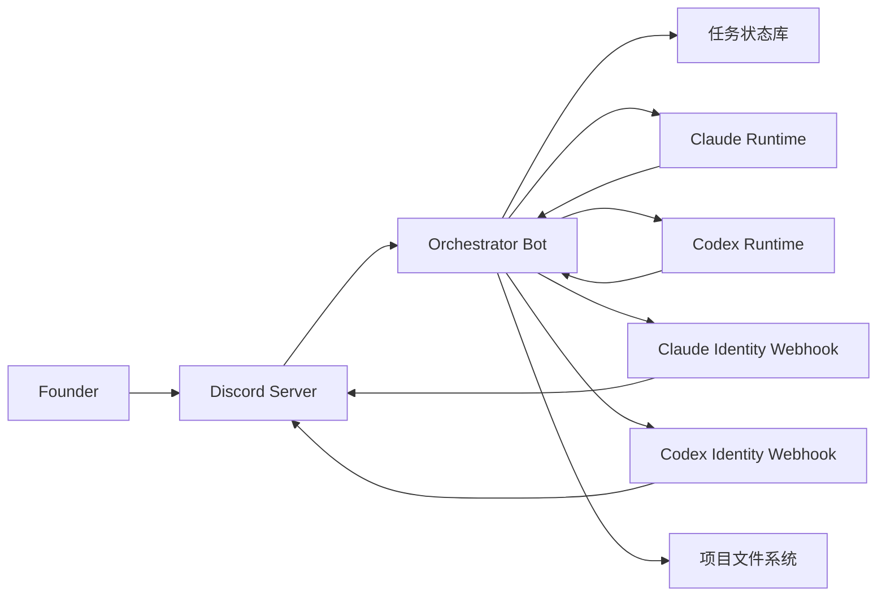
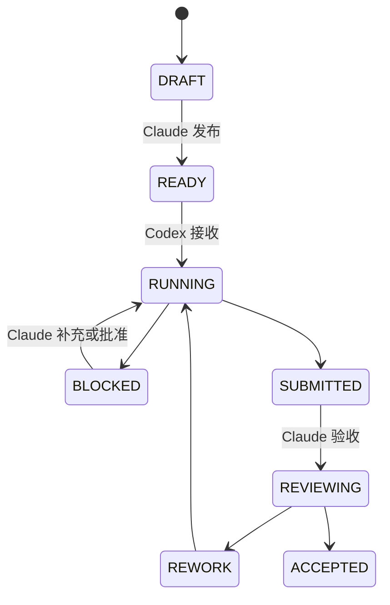
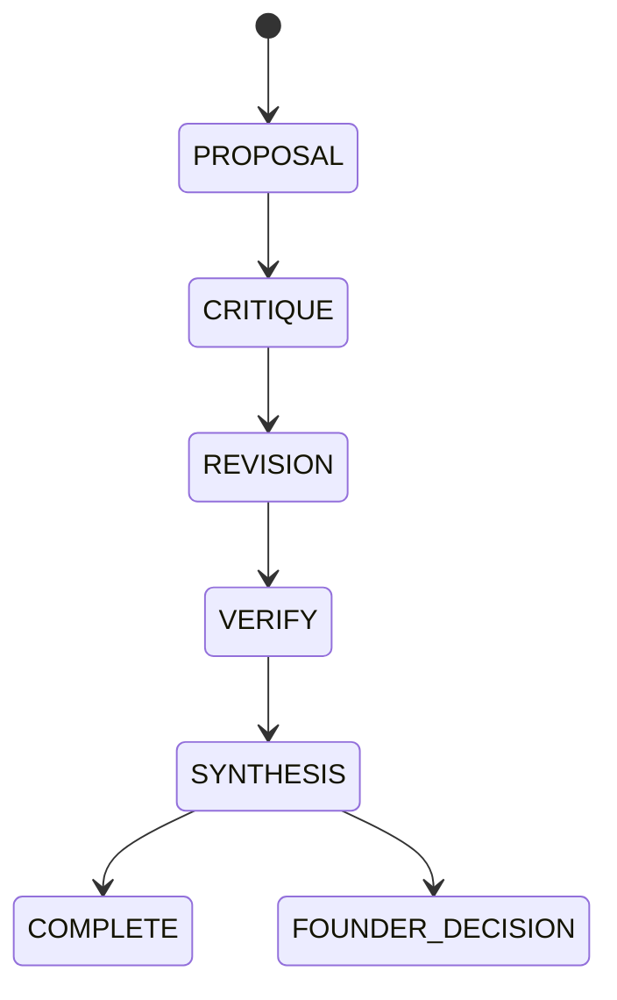

# Claude × Codex Discord 协作控制面调研与方案建议

**版本：** 0.1  
**日期：** 2026-06-14  
**状态：** PROPOSAL（建议稿，未经 Founder 确认，不构成正式架构决策）  
**适用范围：** Claude（CTO）→ Codex（工程执行）任务闭环，以及复杂方案的异模型设计评审  
**不包含：** 交易告警、自动下单、资金操作、生产风控替代

---

## 1. 背景与目标

本方案来自 2026-06-06 至 2026-06-14 对 Claude、Codex、IM 通道及相关开源项目的专项调研。

项目有两个明确目标：

### 目标 A：任务执行闭环

```text
Claude 下发任务 → Codex 接收并执行 → Codex 反馈 → Claude 验收/返工
```

- Claude 保持 CTO 和唯一主控身份。
- Codex 负责复杂实现、调试、测试和工程反馈。
- Founder 不充当双方的信息搬运者。
- 任务必须具备目标、输入、约束、验收标准、禁止事项和写入范围。

该目标与 DEC-006、DEC-016、DEC-021、DEC-071 一致。

### 目标 B：复杂方案审议

```text
一方提出方案 → 另一方独立质疑 → 提案方修订 → Claude 裁决
```

- 用于架构设计、研究设计、复杂规划和高风险实现方案。
- Codex 可以提出专业异议，但不形成与 Claude 平权的决策中心。
- D 级事项仍由 Founder 最终确认。

该目标是 DEC-071 现有 DR（Design Review）文件机制的即时协作扩展。

---

## 2. 证据与调研结论

### 2.1 已检查的内容

用户提供的内容：

- [微信公众号：Claude Code 接入飞书、Discord](https://mp.weixin.qq.com/s/fjGd3mBJ2cHnR7Ctmx7vmA)
- [小红书：让 Claude 和 Codex 辩论的 Skill](http://xhslink.com/o/AXqVRdNdozt)
- [小红书：Claude Code 与 Discord 联动](http://xhslink.com/o/2cLTyaKFE03)
- [小红书：Claude + Codex 异模型 Code Review](http://xhslink.com/o/5wzNzBLmaaQ)
- [小红书：让 Claude Code 和 Codex 成为同事](http://xhslink.com/o/6Gp6IdTV9Lg)

核验的开源项目：

- [op7418/Claude-to-IM](https://github.com/op7418/Claude-to-IM)
- [op7418/Claude-to-IM-skill](https://github.com/op7418/Claude-to-IM-skill)
- [SelunaBai/prd-debate-skill](https://github.com/SelunaBai/prd-debate-skill)
- [CtriXin/agent-2-agent](https://github.com/CtriXin/agent-2-agent)
- [UIengF/claude-codex-teamwork](https://github.com/UIengF/claude-codex-teamwork)
- [zarazhangrui/lark-coding-agent-bridge](https://github.com/zarazhangrui/lark-coding-agent-bridge)
- [Anthropic Claude Plugins Official](https://github.com/anthropics/claude-plugins-official)

### 2.2 可复用机制

| 来源 | 可复用机制 |
|---|---|
| Claude-to-IM | IM 适配、会话绑定、允许列表、可靠投递、审批交互 |
| prd-debate-skill | 主持/提案/审查角色、限轮辩论、共识与分歧记录 |
| agent-2-agent | 异模型优先审查、结构化裁决、不同审查视角 |
| claude-codex-teamwork | Next Actor、状态机、结构化交接、写入范围和文件锁 |
| Claude 官方 Discord Channel | 配对、允许列表、频道启用、提及触发、附件和历史读取 |
| Codex SDK / App Server | 可恢复 Thread、沙箱权限、命令及文件修改审批 |

### 2.3 明确不采用

- 不从 Keychain 提取 Claude OAuth 凭据并缓存为普通文件。
- 不从 IM 通道启动 `danger-full-access`。
- 不默认调用 `codex exec --full-auto`。
- 不让两个 Bot 通过群聊消息自由互相触发。
- 不允许 Claude 和 Codex 同时写同一工作区。
- 不复制无许可证仓库的实现代码。
- 不把模型讨论结论自动升级为项目决策。

---

## 3. IM 通道比较

| 维度 | 飞书 | Discord | Telegram |
|---|---:|---:|---:|
| 任务下发与审批 | 强 | 强 | 中 |
| 复杂方案辩论 | 强 | 很强 | 中 |
| Thread / Forum 隔离 | 强 | 很强 | 中 |
| 中文长文与文档 | 很强 | 中 | 弱 |
| Claude 官方接入 | 无官方 Channel | 有官方 Channel | 有官方 Channel |
| 双 Bot 视觉效果 | 可实现 | 很适合 | 可实现 |
| 初版实现难度 | 中 | 中 | 低 |
| 与现有项目协作贴合度 | 很强 | 强 | 中 |
| 交易告警贴合度 | 中 | 中 | 很强 |

### 3.1 飞书限制

飞书适合工作协作和文档沉淀，但不能依赖群聊中 Bot A `@Bot B` 自动触发 Bot B。成熟适配器也会主动过滤 `sender_type === "bot"`，防止自循环。

因此，飞书只能展示双 Bot 身份，真实调度仍需后台控制器。

### 3.2 Discord限制

Discord 平台可以展示多个 Bot，并拥有成熟的 Thread、Forum、Slash Command、Button 和 Modal。

但 Anthropic 官方 Discord Channel 同样主动忽略 Bot 消息：

```typescript
if (msg.author.bot) return
```

所以即使选择 Discord，也不能依赖两个官方 Bot 自由互聊。Discord 的优势是协作界面，不是替代控制器。

### 3.3 Telegram定位

Telegram Bot API 简单、告警触达直接，并且历史架构已有 Telegram 设计。但它更适合：

- 持仓和风控告警。
- 系统异常。
- 日报和紧急停止。

它不适合承载大量设计讨论和长任务生命周期。

### 3.4 建议分工

- **Discord：** Claude/Codex 任务协作和复杂方案审议。
- **Telegram：** Phase 2 交易系统告警和紧急控制。
- **项目文件：** 唯一权威状态和长期记忆。

这是建议，尚未替代冻结架构中的 Telegram 设计。

---

## 4. 推荐 Discord 架构



### 4.1 核心原则

1. Orchestrator 是唯一 Discord 消息消费者和流程控制者。
2. Claude 与 Codex 不通过 Discord 消息直接通信。
3. Claude 和 Codex 保留各自独立会话。
4. 每一时刻只能有一个 `next_actor`。
5. Discord 是交互和展示界面，不是项目权威状态源。
6. 研究、审议默认只读；执行权限按任务和目录临时授予。
7. Claude 是最终流程裁决者，Founder 保留 D 级决策权。

### 4.2 Bot 身份

第一版使用：

- 一个真正的 `Orchestrator Bot`：接收命令、按钮和用户消息。
- 一个 `Claude Webhook`：以 Claude 名称和头像展示输出。
- 一个 `Codex Webhook`：以 Codex 名称和头像展示输出。

这样可以获得两个独立成员的视觉效果，同时避免维护三个 Gateway 连接和 Bot-to-Bot 循环。

---

## 5. Discord 服务器结构

```text
AI Quant Company
├── 00-CONTROL
│   ├── #founder-command
│   ├── #approvals
│   └── #system-status
├── 01-WORK
│   ├── tasks                 Forum Channel
│   ├── design-reviews        Forum Channel
│   └── #daily-report
└── 02-OBSERVABILITY
    ├── #execution-log
    └── #alerts
```

### 5.1 `tasks`

每个任务创建一个 Forum Post / Thread：

```text
TASK-D2 | TSMOM Extended Backtest
```

Thread 中依次展示：

- Claude 任务规格。
- Codex 接收确认。
- 执行进度。
- 阻塞或权限申请。
- Codex 执行报告。
- Claude 验收或返工结论。

### 5.2 `design-reviews`

每个复杂设计评审创建一个独立 Thread：

```text
DR-E2 | Phase 2 System Architecture
```

建议标签：

- `PROPOSED`
- `CRITIQUING`
- `REVISING`
- `CONSENSUS`
- `CONTESTED`
- `FOUNDER-DECISION`
- `CLOSED`

---

## 6. 工作流一：任务执行闭环



### 6.1 Claude 任务包

```yaml
task_id: TASK-D2
owner: Claude
executor: Codex
target: 明确且可验证的产出
inputs: 相关文件和数据
constraints: 技术与研究约束
acceptance: 可验证验收标准
forbidden: 禁止事项
write_scope: Codex允许写入的路径
timeout: 任务时间上限
```

### 6.2 Codex 反馈

Codex 必须返回：

- 完成状态。
- 修改文件。
- 执行的测试和结果。
- 未解决问题。
- 对任务规格的专业异议。
- 需要 Claude 更新的权威文档。

### 6.3 Claude 验收

Claude 负责：

- 对照任务规格验收。
- 判断 `ACCEPTED` 或 `REWORK`。
- 处理 Codex 的专业异议。
- 更新项目权威状态。
- 必要时创建后续任务。

---

## 7. 工作流二：复杂方案审议



### 7.1 默认角色

- Claude：提案者、主持人和最终综合者。
- Codex：工程审查者、反方和风险发现者。
- Founder：D 级事项裁决者。

对于 Codex 首先提出的工程方案，可交换提案和审查顺序，但 Claude 仍负责最终治理裁决。

### 7.2 轮次约束

- 默认一轮质疑、一轮修订、一轮复核。
- 最多三轮。
- 没有新增高严重度问题时停止。
- 达到时间或 token 上限时停止。
- 涉及重大架构、阶段跨越或资金时转交 Founder。

### 7.3 结构化输出

```json
{
  "consensus": [],
  "disagreements": [],
  "critical_risks": [],
  "evidence": [],
  "recommended_option": "",
  "confidence": 0.0,
  "founder_decision_required": false
}
```

### 7.4 与 DEC-071 的关系

Discord Thread 是 DR 文件机制的交互界面，不替代正式文件：

```text
Discord design-review Thread
    ↓
04_AI_TEAM/DESIGN_REVIEWS/DR_[主题].md
    ↓
04_AI_TEAM/DESIGN_REVIEWS/DR_[主题]_CODEX_CRITIQUE.md
    ↓
Claude定稿 / Founder确认
```

---

## 8. 上下文与记忆同步

现有项目文档已经解决长期记忆，但还需要任务级运行状态。

### 8.1 三层记忆

1. **项目记忆**
   - `DECISION_LOG.md`
   - `CURRENT_STATE.md`
   - 公司 OS 四蓝图
   - 研究协议、任务规格和执行报告

2. **任务记忆**
   - 任务状态。
   - Next Actor。
   - 上下文快照。
   - 审批和事件日志。
   - 写入范围。

3. **模型会话**
   - Claude Session ID。
   - Codex Thread ID。
   - Discord Thread ID。

### 8.2 不做全量上下文同步

同步的是事实、约束和任务状态，不是两个模型的完整聊天记录。

每个任务启动时生成相同的上下文快照：

- 当前阶段。
- 相关 ACTIVE 决策。
- 本任务所需文件。
- 写入范围。
- 验收标准。
- 文件版本或哈希。

Discord 历史只用于展示和审计。任何项目事实必须经过 Claude 验收后写回权威文档。

---

## 9. 状态数据模型

PoC 可使用 SQLite：

```text
task_id
mode: task | review
discord_thread_id
status
next_actor
claude_session_id
codex_thread_id
context_snapshot_hash
allowed_write_scope
round
pending_approval
last_event_id
created_at
updated_at
```

事件日志采用 append-only：

```text
event_id
task_id
actor
event_type
payload_hash
discord_message_id
created_at
```

生产阶段如进入 Phase 2，再评估迁移到 PostgreSQL。

---

## 10. 命令与交互

| 命令 | 功能 |
|---|---|
| `/task` | 创建任务执行闭环 |
| `/review` | 创建复杂方案审议 |
| `/status` | 查看状态、Next Actor、预算和阻塞 |
| `/approve` | 批准受控动作 |
| `/reject` | 拒绝受控动作 |
| `/stop` | 停止当前流程 |
| `/resume` | 恢复中断任务 |
| `/close` | 关闭并归档 Thread |

审批卡片应展示：

- Task ID。
- 请求者。
- 动作摘要。
- 命令或文件修改范围。
- 风险等级。
- 过期时间。
- `Approve once`、`Reject`、`Stop task`。

---

## 11. 权限与安全

### 11.1 Discord 权限

- Discord Server 保持私有。
- Orchestrator Bot 禁止公开安装。
- `#founder-command` 仅 Founder 可写。
- `#approvals` 仅 Founder 与控制器可见。
- 其他频道按最小权限开放。
- 所有命令核对 Discord User Snowflake，不依赖可变用户名。

### 11.2 模型权限

| 模式 | Claude | Codex |
|---|---|---|
| 方案审议 | 只读 | 只读 |
| 任务起草 | 按现有 CTO 边界 | 不启动 |
| 工程执行 | 只读或验收读取 | `workspace_write` + 路径白名单 |
| 权威文档更新 | Claude按现有规则执行 | 禁止 |

### 11.3 需要单独审批

- 网络访问。
- 安装依赖。
- 删除或移动文件。
- 项目目录外写入。
- 访问密钥或凭据。
- 生产服务器操作。
- 交易、仓位或资金相关动作。

Discord 永远不能授予 `full_access` 或绕过项目既有审批。

### 11.4 审批绑定

每个审批操作绑定：

```text
task_id + action_hash + founder_user_id + expiry + nonce
```

防止旧按钮重放、跨任务批准或他人伪造操作。

---

## 12. 技术选型

### 12.1 建议

- 控制器：TypeScript。
- Discord：`discord.js`。
- Claude：Claude Agent SDK，保存并恢复 Session。
- Codex：Codex App Server，保存 `threadId`，接收命令和文件修改审批事件。
- Schema：Zod / JSON Schema。
- PoC 状态库：SQLite。
- 日志：结构化 JSONL + SQLite 事件表。
- 部署：Mac 本地常驻进程；Discord Gateway 为出站连接，无需公网入口。

### 12.2 为什么优先 Codex App Server

Codex SDK适合简单 Thread 调用；App Server 更适合本方案，因为它能提供：

- Thread / Turn 标识。
- 流式事件。
- 命令执行审批。
- 文件修改审批。
- 中断与恢复。

这些事件可以映射为 Discord 按钮和任务状态。

---

## 13. 分阶段实施

### P0：控制面模拟

- 建立私有 Discord Server。
- 创建频道、Forum 和 Orchestrator Bot。
- Claude/Codex 使用模拟响应。
- 验证状态机、Next Actor、按钮、防循环和重启恢复。
- 不连接项目目录。

### P1：只读设计评审

- 接入 Claude 和 Codex。
- 仅开放 `/review`。
- 使用项目外的固定材料。
- 两方均无文件写入权限。
- 评估结论质量、耗时和成本。

### P2：隔离仓库任务闭环

- 开放 `/task`。
- 使用隔离示例仓库。
- Codex 获得限定目录写权限。
- Claude执行验收。
- 测试审批、中断、返工和恢复。

### P3：连接当前项目

只有 P0-P2 全部通过，并经 Founder 确认后：

- 接入现有 TASK_INBOX 和 DR 目录。
- 读取项目权威上下文。
- 保持 Codex 现有写入边界。
- 不改变当前研究执行顺序。

---

## 14. 验收标准

- 100 次测试中无 Bot 消息自循环。
- 每个任务始终只有一个 `next_actor`。
- 控制器重启后能恢复 Discord Thread、Claude Session、Codex Thread 和审批状态。
- 未授权用户不能创建、批准、停止或恢复任务。
- Discord 消息删除或丢失不改变后台权威任务状态。
- Codex 无法写入 Memory Core 和项目管理目录。
- 审议达到轮次或预算上限后自动结束。
- D 级事项不会自动写入 DECISION_LOG。
- 任务完成后能生成符合现有规范的 TASK/REPORT 或 DR/CRITIQUE 文件。

---

## 15. 对当前项目的影响检查

### 15.1 影响模块

- Claude/Codex 任务分派。
- DR 设计评审。
- TASK_INBOX 调度。
- 权限和审批。
- 任务状态与审计。
- 后续消息通道设计。

### 15.2 是否超出当前阶段

完整建设超出当前 Phase 1 的 Alpha 验证主线。当前只适合保留建议稿，或在项目外做严格限时 PoC。

### 15.3 与现有决策的关系

- 与 DEC-006/016/021 的主控与执行边界一致。
- 与 DEC-071 的 DR 机制一致，可作为其交互扩展。
- 不恢复已废弃的多 AI 平权协作。
- 如果用 Discord 替代原冻结架构中的协作型 Telegram 通道，属于架构变更，需要 Founder 正式确认。
- Telegram 仍可保留为 Phase 2 交易告警通道。

### 15.4 主要风险

- **风险 B：** 建设协作平台挤占 Alpha 验证。
- **风险 C：** 在讨论和工具搭建中停滞。
- 上下文快照错误导致双方依据不同版本工作。
- 远程审批误授予过高权限。
- 会话恢复和文件状态不一致。
- 模型争论增加成本但没有增加有效发现。

建议设置固定时间盒和退出条件，不将该项目升级为当前主线。

---

## 16. 待 Founder 决策

1. 是否认可 Discord 作为 Claude/Codex 协作控制面的候选主通道。
2. 是否认可 Telegram 保留为未来交易告警通道。
3. 是否允许在项目目录外启动 P0 控制面模拟。
4. PoC 是否必须等当前在途 D1/D2/E2 和运行流程 v2 审阅完成后再开始。

在以上事项正式确认前，本文件仅作为方案储备，不进入执行队列。

---

## 17. 官方资料

- [Discord Threads](https://docs.discord.com/developers/topics/threads)
- [Discord Interactions](https://docs.discord.com/developers/interactions/overview)
- [Discord Gateway](https://docs.discord.com/developers/events/gateway)
- [Claude 官方 Discord Channel](https://github.com/anthropics/claude-plugins-official/tree/main/external_plugins/discord)
- [Claude Agent SDK Sessions](https://platform.claude.com/docs/en/agent-sdk/sessions)
- [OpenAI Codex SDK](https://developers.openai.com/codex/sdk)
- [OpenAI Codex App Server](https://developers.openai.com/codex/app-server)

【等待Founder确认】
