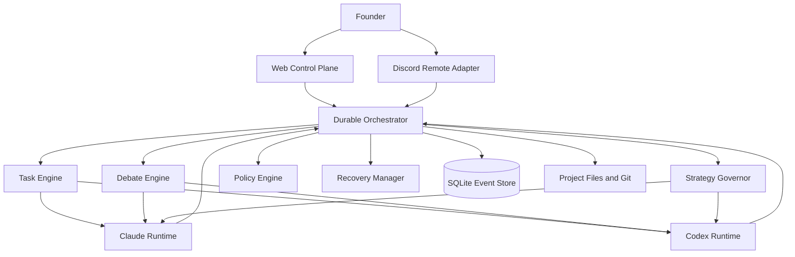

# GOV-AUTO-001 项目顶层治理与 Claude-Codex 高自治协作分析

**状态：** ANALYSIS / 供 Claude 独立论证，非正式架构决策
**日期：** 2026-06-20
**作者：** Codex
**适用范围：** AI_QUANT_COMPANY 公司级治理、项目群管理、研究治理、Claude/Codex 协作与自动化控制面
**明确不做：** 本报告不初始化 Spec Kit、不修改权威状态、不批准新研究、不建设编排器、不触碰 Holdout 或预登记

> **[专业异议]** 当前新主线 `P1-RES-034` 不能按现有描述直接执行。DEC-080 同时引入 Regime 检测、TSMOM、10-20x 杠杆和新验收指标，违反单变量与机制优先原则；“月化 30% 目标”与 DEC-063、CLAUDE.md 及 BOOT_BRIEF 中“月化 30% 不是验收条件”冲突。Claude 应先完成方向与验收口径裁决，再允许 Spec Kit 生成实验规格或派 Codex 实现。

---

## 1. 报告目的

Founder 要求重新确定项目信息，并基于当前对话全部讨论，从公司顶层而非单一任务视角回答：

1. 项目当前真实处于什么状态。
2. 顶层治理与项目管理的主要缺口是什么。
3. Claude 与 Codex 应如何分工、辩论、裁决并高自治协作。
4. 如何避免 AI 在既有框架内不断下钻，形成局部最优。
5. Discord、Web 控制台、编排器、Spec Kit、Superpowers、ADR、C4 分别放在哪一层。
6. 是否需要全项目重构，以及合理的渐进实施顺序。

本报告是给 Claude 的独立分析输入。Claude 应逐条反驳、确认或修订，不应直接把本报告升级为 DECISION。

### 1.1 本报告覆盖矩阵

| 维度 | 本报告回答的问题 |
|---|---|
| 公司战略与目标函数 | 公司究竟追求什么，收益愿望与研究验收如何分离 |
| Alpha 研究 | 新主线是否符合机制优先、单变量、预登记和 Holdout 纪律 |
| 策略产品化 | 研究结论如何转为冻结规格、ATD 和平台接口 |
| 交易平台与数据 | 何时借力 Freqtrade/CCXT，何时建设薄层能力 |
| 实时风控 | 什么能力未建成前禁止实盘，AI 不得进入哪条权限链 |
| 运营与事件响应 | 监控、告警、接管、恢复和事故闭环如何进入公司建设计划 |
| 资本、账务与归因 | 真实 PnL、资金、费用、funding 和 NAV 如何形成审计闭环 |
| 治理、知识与审计 | 权威文件、DEC/ADR、墓园、历史污染和知识复用如何治理 |
| 项目组合管理 | 公司级总图、WBS、WIP、阶段门和任务状态如何统一 |
| AI 组织 | Founder、Claude、Codex、Reviewer 和确定性编排器如何分权 |
| 自动化控制面 | Web、Discord、Orchestrator、事件库和恢复如何分层 |
| 工具方法论 | Superpowers、Spec Kit、AGENTS、CLAUDE、ADR、C4 如何互补 |
| 迁移与实施 | 哪些冻结、哪些整理、哪些新增，以及如何避免 Big Bang 重构 |

---

## 2. 信息基线与权威边界

### 2.1 本次重新核验的当前事实

- 当前阶段：Phase 1，目标仍应是寻找真实、可持续、可放大的 edge。
- carry 已由 DEC-079 正式关闭，相关执行、产品化和部署任务已废弃。
- 新方向由 DEC-080 定为 regime-adaptive 方向性永续策略。
- 新主线任务是 `P1-RES-034`，尚未形成合格任务书或预登记。
- 127 个历史数据 parquet 已落盘，可作为后续数据输入，但“有数据”不等于“新假设成立”。
- DEC-081 已确认治理工具方向：Superpowers + Spec Kit + AGENTS.md + ADR + C4。
- Claude/Codex 自动化编排尚未建立；现有 TASK_INBOX、任务报告和直调脚本只是局部链路。
- 项目当前工作树存在多份未提交权威状态变更，`master` 领先远端 33 个提交。
- Founder 本轮已确认协作原则：高自治模式；Claude 最终裁决；每 3 个任务固定战略复评，失败、返工、成本或证据异常时即时复评。

### 2.2 当前权威文件的实际关系

| 信息类型 | 应读取的权威 | 当前问题 |
|---|---|---|
| Founder 已确认决策 | `DECISION_LOG.md` | 战略、技术、流程决策混在一个 2000+ 行文件中 |
| 当前运行焦点 | `CURRENT_STATE.md` | §1 与 §4 已出现新旧主线并存 |
| 详细任务状态 | `PROJECT_TASK_PLAN.md` | 文件前部已切换到 P1-RES-034，底部关键路径仍是 carry |
| 启动摘要 | `BOOT_BRIEF.md` | 新主线已更新，但 8 维表和“最新 DEC”指针仍有旧值 |
| 研究规则 | Research Protocol v1.3/v1.4 | 与 DEC-080 的验收指标尚未对齐 |
| 公司终态与能力地图 | `COMPANY_BUILD_MASTERPLAN_v1.md` | 仍为 DRAFT，未获 Founder 正式确认 |
| Claude/Codex 行为约束 | `CLAUDE.md` / `AGENTS.md` | 与 SYSTEM_RULES、AGENT_REGISTRY 存在冲突 |

### 2.3 结论

项目不是“没有治理”，而是“治理设计丰富、权威升格和运行一致性不足”。目前不能让自动编排器直接消费这些文件并连续执行，否则它会高效率地放大状态漂移和错误方向。

---

## 3. 当前项目的顶层判断

### 3.1 已经具备的能力

1. **研究治理强。** 已有预登记、单变量、WF、成本、Holdout、功效、盲审、墓园和失败叙事纪律。
2. **公司级框架已经出现。** 公司建设总图覆盖 9 个能力域、7 条 L1 价值流和 Phase 0-3。
3. **任务组合框架已经出现。** PROJECT_TASK_PLAN 已覆盖全域 WBS、状态、依赖和阶段门。
4. **AI 文件式协作已验证。** Claude 能写任务书、Codex 能执行和回报、Claude 能验收。
5. **独立审查文化已经建立。** Codex 有专业异议义务，Risk Reviewer 和 DR 文件链已有实践。
6. **数据和研究资产可复用。** carry 被关闭不意味着其数据采购产物必须删除，数据可在新假设下重新评估适用性。

### 3.2 尚未形成运行能力的领域

1. 生产交易平台和统一状态模型。
2. 实时风控、账本、三方对账和恢复。
3. 交易运营、监控、告警、事故响应和 on-call。
4. 资本会计、真实成本归因和税务证据。
5. 可靠的 Claude/Codex 自动调度、审批、重试和会话恢复。
6. 可检测权威冲突、断链和过期状态的机器校验。
7. 公司级总图、阶段门与项目终态的正式 Founder 决策。

### 3.3 当前最核心的问题

项目的首要问题不是“缺更多工具”，而是以下闭环尚未成立：

```text
目标与机制
  -> 可证伪假设
  -> 独立反审
  -> 单一任务权威
  -> 有界执行
  -> 结果验收
  -> 战略复评
  -> 决策与状态一致写回
```

只要这个闭环不稳定，Spec Kit、Discord、Web UI 或多 Agent 都只会增加速度，不会增加正确性。

### 3.4 公司九大能力域复核

| 能力域 | 当前判断 | 主要证据 | 当前最重要缺口 |
|---|---|---|---|
| 战略、目标函数与资本边界 | 部分成熟 | DEC-063/069、两层资本、时间盒和成本盒 | DEC-080 与 DEC-063 冲突；公司总图仍未确认 |
| Alpha 研究与证据管理 | 流程成熟、方向不稳定 | Research Protocol、预登记、盲审、墓园 | Founder 起始否决未入账导致 carry 长链误执行；新方向尚未过机制门 |
| 策略产品化 | 部分 | R-S-E SOP、历史 carry v4 规格经验 | 尚无真实通过研究门并完成 SPEC/ATD 的策略 |
| 交易平台与数据基础设施 | 草图到部分 | 历史数据脚本、强平采集器、Freqtrade/CCXT 路线 | 数据合同、持久状态、幂等、回放、恢复和生产 Schema 未建 |
| 实时风控与资本保护 | 草图 | 风控决策和 E1-E4 设计 | Decision Gateway、Position Registry、对账、硬阻断、急停未实现 |
| 交易运营、监控与事件响应 | 基本空白 | 单点采集器 heartbeat、周/月审 | SLI/SLO、告警责任、Runbook、人工接管和恢复演练缺失 |
| 资本、账务与绩效归因 | 草图 | 研究级成本分解和 NAV 设想 | 生产账本、交易所账单导入、日结/月结、归因与税务证据未建 |
| 治理、知识与审计 | 设计强、运行中等 | CLAUDE/AGENTS、Memory Core、审计、墓园、TASK_INBOX | 权威冲突、报告积压、state_check 假绿灯、运行日志不全 |
| 项目组合与交付管理 | 部分 | 公司总图、108 项 WBS、任务报告 | WIP/里程碑不足；方向变更未完整传播；自动编排未形成 |

这里最需要避免的误判是：研究治理文件丰富，不等于公司整体成熟；架构文档存在，也不等于生产交易能力存在。

### 3.5 顶层框架仍缺什么

1. **正式公司章程。** 当前 `CONSTITUTION.md` 实质更接近旧系统架构，不应继续承担公司目标、研究门槛和系统蓝图的混合职责。
2. **获批的公司建设总图。** `COMPANY_BUILD_MASTERPLAN_v1` 已经接近正确形态，但仍是 DRAFT，Phase 1→2、Phase 2→3 的真实阶段门没有正式升格。
3. **决策分类。** Founder/资本/研究方向决策、技术 ADR、运行事件和暂存建议需要分层，不能继续全部堆入一个决策日志。
4. **当前态架构。** `05_ARCHITECTURE/` 为空，缺少可信的 C4 当前态；现有技术图容易把“计划建设”误读为“已经存在”。
5. **证据化成熟度。** 每一能力从空白、草图、部分到成熟，应绑定测试、运行、对账、恢复和审计证据，而不是文档作者判断。
6. **项目群节奏。** 需要明确战略主线、治理改造和被动数据积累三类 WIP，避免治理工作与研究工作互相吞噬。
7. **变更传播协议。** 一次 DEC 变更应机械更新任务、状态、摘要、机会地图、墓园和关联规格；当前依赖人工记忆。

### 3.6 此前容易遗漏的非局部风险

#### 资本与业务

- 30,000 元本金、约 1,000 元/月预算与高频工具/数据订阅之间可能存在负单位经济性。
- “月化 30%”容易把研究变成收益目标驱动的数据挖掘，并诱导过早使用杠杆。
- 围栏资本可归零不代表可以绕过证据门、账户隔离、最大损失和恢复规则。

#### 数据与模型风险

- 数据源正确性、时间戳、价格类型、funding、合约更替、缺失和 cutoff 需要统一 Data Contract。
- Regime 标签本身存在非平稳、后验分类、状态切换延迟和样本不平衡风险。
- 模型/提示词/Skill 版本也会改变研究判断，应记录 Agent、模型、Skill 和上下文快照版本。

#### 生产与运营

- “服务进程存活”不等于业务数据健康，强平采集器事故已经证明这一点。
- 交易所接口、限频、账户权限、网络分区和时钟偏差都可能产生静默错误。
- 备份、灾难恢复、人工接管和事故复盘尚未形成可演练机制。

#### 安全与合规

- API Key 最小权限、轮换、泄漏响应和生产环境隔离需要在自动化接入前确定。
- Discord/Web 审批不能直接扩大 Agent 沙箱或授予资金权限。
- 交易所地域政策、账户冻结、税务和出入金证据需要进入 Phase 2 硬门。

#### AI 组织

- Claude 最终裁决会形成新的单点认知风险，必须由 Codex 盲审、书面异议和 Strategy Governor 制衡。
- 两个模型可能共享训练偏见；“异模型一致”不是事实证明，重大结论仍需数据和确定性测试。
- 自动化提高吞吐后，错误方向的成本也会放大，因此方向复评优先于并行化。

#### 人因与可持续性

- Founder 每日约 1 小时，不适合承担信息搬运、任务追踪和频繁审批。
- 但 Founder 仍需看到少量高质量 D 级决策包，不能因“高自治”失去实际控制。
- 文档和工具数量已经较多，任何新增系统都必须证明删除了哪些人工步骤。

---

## 4. 对新方向 DEC-080 / P1-RES-034 的专业异议

### 4.1 验收目标冲突

DEC-063 和当前项目原则明确：月化 30% 不是公司级验收条件，高杠杆是仓位表达工具而不是 Alpha 来源。DEC-080 又把“月化 30% 目标”写入新方向，并将趋势 regime 月均收益、最大回撤、全样本 Sharpe 设为首个实验验收指标。

需要 Claude 裁决：

- “月化 30%”究竟是 Founder 的资本愿望、探索性上限，还是正式研究门槛。
- 若只是愿望，必须从假设验收标准中删除，避免反向筛选参数。
- 若坚持作为硬门槛，则它正式推翻 DEC-063，必须说明证据、风险和资本后果，不能同时保留两套口径。

### 4.2 单变量原则冲突

现有 P1-RES-034 同时变化：

1. 新 Regime 分类器（ATR 百分位 + ADX）。
2. TSMOM 在 Regime 内的门控方式。
3. 10-20x 杠杆。
4. 新收益和回撤验收尺。

该实验即使成功，也无法区分收益来自状态识别、TSMOM、杠杆还是参数选择；失败同样无法定位原因。

建议拆为顺序实验：

1. **机制卡：** 为什么趋势溢价在特定状态持续存在，谁在付钱，经什么路径进入策略收益。
2. **数据与标签审计：** Regime 定义是否存在前视、状态切换延迟和样本不平衡。
3. **Experiment A：** 固定现有 TSMOM 与 1x 仓位，只测试单一 Regime 门控是否改善预登记指标。
4. **Experiment B：** A 通过后，才在冻结信号上测试仓位或波动目标。
5. **Experiment C：** 只有 edge 和仓位模型均通过后，才测试杠杆敏感性和爆仓概率。

### 4.3 研究顺序冲突

当前描述从“ATR+ADX × TSMOM × 10-20x”直接开始，仍有“先组合信号和杠杆，再寻找机制解释”的风险。Claude 应先回答七问和机制付费链，再决定是否立项。

### 4.4 Spec Kit 使用风险

Spec Kit 可以把模糊想法写得结构化，但不能判断研究方向是否正确。若现在直接 `/speckit.specify`，它可能把一个违反研究铁律的想法包装成完整规格。

因此顺序必须是：

```text
Claude/Codex 方向审议
  -> Claude 裁决机制与单变量实验
  -> Research Preregistration 冻结
  -> Spec Kit 仅生成工程实现规格
```

Spec Kit 不得替代研究预登记，不得读取 Holdout，不得自行生成验收指标。

---

## 5. Claude 与 Codex 的目标组织模型

### 5.1 角色基线

| 角色 | Accountable 范围 | 不应承担 |
|---|---|---|
| Founder | 公司范围、资金、阶段跨越、重大方向和不可逆风险 | 日常派单、技术搬运、任务追踪 |
| Claude | Operating Principal；战略议程、项目组合、研究方向、验收、最终技术裁决 | 无审查地把自己的观点直接变成执行任务 |
| Codex | Engineering Lead + Independent Challenger；工程方案、实现、测试、复现、专业异议 | 公司战略、资本和最终方向裁决 |
| Orchestrator | 状态机、派单、重试、恢复、权限和证据完整性 | 专业判断和研究结论 |
| Strategy Governor | 触发全局复评并收集独立观点 | 自行改变 Founder 或 Claude 的决策 |

结论：项目主导仍由 Claude 承担，不建议简单切换为 Codex。解决单点偏差的方式是强制独立反审、书面裁决和周期性升维复评，不是更换单一主导模型。

### 5.2 Claude 裁决义务

Claude 可以否决 Codex，但必须记录：

1. Codex 的核心异议。
2. Claude 接受或否决的理由。
3. 依赖了哪些事实和决策。
4. 哪些风险仍未消除。
5. 何种新证据会触发重开。

未回应高严重度异议时，Orchestrator 不得进入执行态。

---

## 6. 防止局部最优：Strategy Governor

### 6.1 为什么现有七问不够

七问是任务前自检，仍由正在推进任务的 Agent 自己回答，容易在既有问题定义中合理化继续执行。Strategy Governor 必须独立于当前任务链，对“为什么还在做这件事”负责。

### 6.2 固定触发

- 每完成 3 个任务触发一次全局复评。
- 每个阶段门前触发。
- 每次项目方向变更后的第一个任务前触发。

### 6.3 即时触发

- 同一任务两次返工。
- 连续两个任务围绕同一失败点修改参数、过滤器或退出规则。
- 实验结果与机制预期方向相反。
- 数据适用性、成本或权限前提变化。
- 任务成本、token、时间或文件增长异常。
- Claude/Codex 对问题定义存在重大分歧。
- 新任务无法指出它将消除哪项关键不确定性。

### 6.4 盲评流程

```text
触发复评
  -> 冻结当前任务队列
  -> Claude 独立写问题定义与推荐路线
  -> Codex 独立写问题定义与替代路线
  -> 双方交换并交叉质询
  -> Claude 书面裁决
  -> CONTINUE / REFRAME / PAUSE / KILL / PIVOT
  -> 更新任务计划和恢复执行
```

双方第一稿使用相同上下文快照，但互不可见，防止锚定和迎合。

### 6.5 必答问题

1. 当前任务服务于哪一条公司价值流和阶段出口。
2. 最上游仍未回答的问题是什么。
3. 最近 3 个任务减少了什么不确定性。
4. 是否正在把失败解释成更多同类任务。
5. 有无更便宜、信息增益更高的替代实验。
6. 若今天从零开始，还会选择当前路线吗。
7. 继续、暂停和转向各自的机会成本是什么。

---

## 7. 高自治协作架构

### 7.1 推荐总体架构



### 7.2 控制面的正确分层

- **Web 控制台：** 主控制面，展示目标、任务图、辩论、裁决、预算、权限、阶段门和恢复状态。
- **Discord：** 手机远程入口、日报、异常通知、批准、停止和恢复，不是权威状态源。
- **Orchestrator：** 真正的流程控制者；Discord 消息丢失不影响任务状态。
- **SQLite 事件库：** PoC 的运行状态与 append-only 事件源。
- **项目文件 + Git：** 长期事实、规格、报告、决策和代码权威。

### 7.3 为什么不以 Discord 为核心

Discord 很适合 Thread、Forum、移动通知和双 Agent 的可视化讨论，但不适合表达跨任务依赖、战略复评、预算曲线、权限状态和中断恢复。正确方案是保留原 Discord 提案的 Orchestrator 设计，把 Discord 降为适配器。

### 7.4 为什么首版不引 Temporal

当前只有一个项目、两个主要 Agent、低并发和 Mac 本地运行。SQLite + 单进程状态机足以验证价值。只有出现跨机器执行、大量并行、长周期定时和复杂补偿事务时，才评估迁移到 Temporal 等持久工作流引擎。

### 7.5 可选方案比较

| 方案 | 优势 | 主要问题 | 适合定位 |
|---|---|---|---|
| Discord 中心化 | Thread、移动端、通知和审批体验好 | 任务图、恢复、预算、战略复评弱；平台依赖 | 远程适配器，不作核心 |
| 本地 Orchestrator + Web | 能表达状态机、依赖、辩论、阶段门和恢复 | 需要开发一个轻量控制台 | 当前推荐主方案 |
| GitHub Issues/PR/Actions | 代码审查、提交和历史证据强 | 研究辩论和长任务上下文差；会制造第二任务账本 | 代码交付适配器 |
| Temporal 类持久工作流 | 重试、定时、恢复、补偿和跨机器强 | 对当前规模过重，增加运维面 | 规模化后的替换内核 |
| n8n/低代码流 | 原型快、连接器多 | 复杂 Agent 状态、权限、审议和幂等难严谨表达 | 辅助通知，不作核心 |
| 纯文件 TASK_INBOX daemon | 贴合现有项目、实现便宜 | 缺少任务图、会话恢复、审批和 Strategy Governor | G0/G1 过渡方案 |

最佳方案不是在这些选项中“全选”，而是保持一个确定性编排内核，并把 Web、Discord、GitHub 作为可替换 Adapter。

---

## 8. 两类工作流

### 8.1 普通任务执行闭环

```text
DRAFT
 -> PROFESSIONAL_REVIEW
 -> READY
 -> RUNNING_CODEX
 -> SUBMITTED
 -> REVIEWING_CLAUDE
 -> ACCEPTED | REWORK | BLOCKED | FAILED
 -> STRATEGY_CHECK
 -> NEXT_TASK | STOP
```

规则：

- 每一时刻只有一个 `next_actor`。
- Claude 负责验收，不得由 Codex 自报完成后自动升级项目状态。
- Codex 可提出 `[专业异议]`，高严重度异议强制进入 Claude 裁决。
- ACCEPTED 后不必等待 Founder，Orchestrator 可继续派发非 D 级下一任务。
- 执行任务不能自行拆出无上限的同类后续任务。

### 8.2 复杂方案审议闭环

适用于架构、研究设计、重大规划、高风险实现和连续失败后的方向复评。

```text
CONTEXT_FREEZE
 -> BLIND_PROPOSALS
 -> CROSS_CRITIQUE
 -> REVISION
 -> VERIFICATION
 -> CLAUDE_ADJUDICATION
 -> ACCEPTED | REFRAME | FOUNDER_DECISION
```

默认一轮提案、一轮质询、一轮修订；最多三轮。没有新增高严重度问题时停止，避免为辩论而辩论。

---

## 9. 自动化停止边界

以下情况必须暂停并通知 Founder：

1. 使用真实资金或修改交易账户权限。
2. 阶段跨越、公司范围或资本上限变化。
3. 触碰 Holdout、修改冻结预登记或违反研究铁律。
4. Claude 与 Codex 两轮后仍有重大分歧。
5. 同一任务连续失败三次，或预算/时间将越界。
6. 涉及密钥、生产数据删除、不可逆部署或项目外高风险写入。
7. 新决策与已有 Founder D 级决策冲突。

其他研究准备、设计评审、实现、测试、修复、验收和状态同步可在权限范围内自动连续推进。

---

## 10. 任务与事件数据模型

### 10.1 任务最小字段

```yaml
task_id: GOV-AUTO-001
parent_id: null
objective: 可验证目标
mechanism_or_business_reason: 为什么值得做
value_stream: 决策到交付
phase_gate: Phase 1
mode: task | design_review | strategy_review
owner: Claude
executor: Codex
status: READY
next_actor: Codex
inputs: []
constraints: []
acceptance: []
forbidden: []
write_scope: []
budget: {}
context_snapshot_hash: sha256
claude_session_id: null
codex_thread_id: null
discord_thread_id: null
```

### 10.2 事件日志

每次状态变化写 append-only 事件：

```text
event_id / task_id / actor / event_type / payload_hash /
previous_state / next_state / created_at
```

事件库记录运行事实；项目文件记录验收后的长期结论。两者不能互相替代。

---

## 11. AGENTS.md、CLAUDE.md、ADR、C4、Spec Kit 的位置

### 11.1 AGENTS.md

只保留 Codex 必须始终加载的规则：角色、写入边界、研究禁止项、异议义务、交付格式和完成通知。具体研究门槛引用 Research Protocol，不重复维护。

必须先解决：AGENTS 要求每任务 commit，而 AGENT_REGISTRY 禁止 Codex commit 的冲突。

### 11.2 CLAUDE.md

保留 Operating Principal 职责、D 级边界、启动入口、反迎合、状态同步和裁决义务。复杂流程下沉为 Skills，避免每次会话加载全部细节。

必须先解决：CLAUDE.md 强制把建议写入 §1c，而 SYSTEM_RULES 禁止对话分析进入 Memory Core 的冲突。

### 11.3 ADR

DECISION_LOG 保留公司战略、资本和 Founder 决策；ADR 专门记录技术架构选择的背景、备选项、后果和替代关系。

建议 ADR 起点：

- ADR-001 不应是“新研究方向重置”，因为那是业务/研究方向 DEC，不是技术架构。
- ADR-001 更适合记录“协作控制面采用独立 Orchestrator，Web 为主、Discord 为适配器”。
- Freqtrade + CCXT 路线可作为后续技术 ADR。

### 11.4 C4

`05_ARCHITECTURE/` 当前为空。先补：

1. System Context：Founder、Claude、Codex、交易所、项目文件、未来交易系统。
2. Container：Orchestrator、Web、Discord Adapter、Agent Runtime、事件库、Git 工作区。
3. Deployment：Mac 控制面、云采集器、未来 paper/live 环境。

Component 图只画开始建设的模块，不画远期幻想架构。

### 11.5 Spec Kit

适合：工程功能规格、接口、实现计划、任务拆分和一致性分析。

不适合替代：

- 公司 Constitution。
- Research Preregistration。
- PROJECT_TASK_PLAN 项目组合权威。
- DECISION_LOG / ADR。
- Strategy Governor 的方向判断。

建议先用协作控制面中的一个小型、非交易、非 Holdout 功能做试点；不要直接拿 P1-RES-034 当第一个 Spec Kit 试点。

### 11.6 PROJECT_TASK_PLAN

继续作为公司项目组合和详细 WBS 的唯一权威，但应收敛到以下字段：

- 任务 ID、父目标、能力域、价值流和阶段门。
- 状态、负责人、执行者、依赖和 next_actor。
- 验收证据、阻塞条件、复活条件和决策来源。
- WIP 类别：战略主线、治理改造、被动积累、未来候选。

任务计划不应存放完整实现规格；Spec Kit task 也不能反向成为第二套公司 WBS。Orchestrator 只读取已通过一致性检查的任务快照。

### 11.7 Superpowers

Superpowers 放在执行纪律层：brainstorming、计划、TDD、调试、review 和完成前验证。它不负责保存公司路线图，也不替代 Strategy Governor。对于研究工作，Superpowers 的 TDD 只约束工程实现，不能把研究假设“测试驱动”成事后拟合。

---

## 12. 开源项目治理工具组合策略

### 12.1 总原则

开源项目不是“治理成熟度勋章”。每个工具只有在满足以下条件时才进入主流程：

1. 对应一个已验证的真实问题，而不是抽象的未来需求。
2. 明确替代或删除现有哪一步人工工作。
3. 不创建新的任务权威、决策权威或知识孤岛。
4. 有 Owner、输入、输出、验收、成本和退出条件。
5. 能在不污染研究证据和生产权限的情况下限时试点。
6. 失败后可以卸载，不留下强耦合格式或数据锁定。

### 12.2 组合结论

| 项目/方法 | 官方定位 | 当前建议 | 在本项目的具体用途 | 禁止用途 |
|---|---|---|---|---|
| [Superpowers](https://github.com/obra/superpowers) | Agent 软件开发方法与组合 Skills | **现在采用** | brainstorming、计划、TDD、调试、review、验证；Claude/Codex 共享执行纪律 | 不存公司路线图；不替代研究协议或 Strategy Governor |
| [GitHub Spec Kit](https://github.com/github/spec-kit) | Spec-Driven Development 工具包 | **G0 后限时试点** | 工程功能的 specification、plan、tasks、consistency analysis | 不替代预登记、DEC、ADR、公司总图或 PROJECT_TASK_PLAN |
| [adr-tools](https://github.com/npryce/adr-tools) | Markdown ADR 日志工具 | **采用格式，CLI可选** | 技术架构决策、supersede 链、背景/备选/后果 | 不记录 Founder 业务方向和资本决策 |
| [C4-PlantUML](https://github.com/plantuml-stdlib/C4-PlantUML) | 代码化 C4 架构图 | **近期采用** | 当前态 System Context、Container、Deployment；Git 可审计 | 不画尚未建设的“理想全系统”冒充现状 |
| [Backstage](https://github.com/backstage/backstage) | 软件目录、模板、TechDocs 的开发者门户框架 | **后置** | 将来服务/数据管线/模型数量明显增长时做资产目录和统一入口 | 当前不为单项目、少量服务建设门户平台 |
| [Apache DevLake](https://github.com/apache/devlake) | 汇聚 DevOps 数据并分析工程效能 | **后置** | 有稳定 GitHub/CI/部署/Issue 数据后，统计交付与恢复指标 | 当前不能用空数据或少量提交制造“工程效能仪表盘” |
| [Middleware/DORA](https://github.com/middlewarehq/middleware) | DORA 工程效能指标平台 | **后置或不单独部署** | 真实生产部署形成频率、Lead Time、CFR、MTTR 后再评估 | 不把代码提交数、Agent任务数当业务产出 |
| [BMAD-METHOD](https://github.com/bmad-code-org/BMAD-METHOD) | 多角色、全生命周期 AI 敏捷方法 | **当前不安装** | 只借鉴角色分离、规模适配和结构化工作流思想 | 不与 Superpowers + Spec Kit 再建一套角色和生命周期 |
| [Task Master](https://github.com/eyaltoledano/claude-task-master) | AI 驱动任务拆分、依赖、循环和工作流管理 | **当前不安装** | 借鉴依赖、workstream、loop 和任务状态设计 | 不建立第二套 WBS，不替代 PROJECT_TASK_PLAN/Orchestrator |
| [MCP Shrimp Task Manager](https://github.com/cjo4m06/mcp-shrimp-task-manager) | MCP 任务拆分与跨会话上下文管理 | **当前不安装** | 借鉴跨会话任务记忆和复杂任务拆分 | 不再增加一个 Agent 专属任务源 |
| [Plane](https://github.com/makeplane/plane) | Work Items、Cycles、Modules、Roadmap 项目管理 | **后置** | 多人团队、多个项目或 Founder 需要成熟看板时再评估 | 当前不复制 108 项 WBS 到外部系统人工双写 |

### 12.3 现在真正应该利用的四项

#### Superpowers：统一执行纪律

- Claude 与 Codex 都安装，但版本不同；应定义项目最低共同能力集，而不是假设两个版本行为完全一致。
- 共同要求：先设计、再计划、TDD、系统调试、独立 review、完成前验证。
- Claude 用它约束方案与委派；Codex 用它约束实现和验证。
- 项目研究协议始终高于通用软件方法。

#### Spec Kit：只进入工程规格层

建议第一个试点不是新 Alpha 实验，而是一个低风险、边界清楚的工程功能，例如：

- `state_check` 权威一致性检测；或
- Orchestrator 的只读任务快照模块；或
- DATA_CONTRACT schema 与校验器。

试点验收：

1. Spec Kit 产物没有复制 PROJECT_TASK_PLAN。
2. spec/plan/tasks 能追溯到一个正式项目任务 ID。
3. Claude 与 Codex 都能读取并按同一验收理解执行。
4. 与 Superpowers 的阶段分工清楚，没有重复规划。
5. 试点结束后明确保留、修改或移除。

#### ADR：把技术理由从超长 DECISION_LOG 中分离

ADR 采用轻量 Markdown 即可，不必为了 CLI 本身增加依赖。每篇至少包含：Context、Decision、Alternatives、Consequences、Status、Supersedes/Related DEC。

首批建议：

1. 协作控制面采用独立 Orchestrator，Web 为主、Discord 为 Adapter。
2. Orchestrator PoC 采用 SQLite append-only event store。
3. Freqtrade + CCXT + 薄风险/审计层的 build-vs-buy 决策。

研究方向重置继续留在 DECISION_LOG，不伪装成 ADR。

#### C4：建立可信的当前态地图

- Level 1：公司系统、Founder、Claude、Codex、交易所、云采集器和外部通道。
- Level 2：研究系统、协作控制面、未来 paper/live 系统及其真实边界。
- Deployment：Mac、腾讯云、GitHub、未来交易环境。
- 每个元素标记 `Current / Planned / Deprecated`，防止架构图把设计稿冒充能力。

### 12.4 为什么现在不装 Backstage、DevLake、DORA 和 Plane

#### Backstage

Backstage 的核心价值是集中管理大量软件资产、基础设施、模板和文档。当前只有一个微型公司项目、少量运行服务和单一 Founder，建设门户的维护成本高于目录收益。

重评触发：

- 可运行服务、数据管线、模型或策略实例达到约 15-20 个。
- 出现多个环境、多个 Owner 或频繁新建服务。
- 资产归属、文档发现和模板一致性成为真实阻塞。

#### DevLake / DORA

这些工具需要真实且持续的 Issue、PR、CI、部署和事故数据。目前项目缺少稳定 CI/CD 与生产部署频率，先装只会得到漂亮但无意义的指标。

重评触发：

- 生产或 paper 部署持续至少 8-12 周。
- 有明确的部署、失败和恢复事件源。
- Founder 确实需要趋势而不是单次审计。

#### Plane

Plane 能提供成熟项目看板，但当前已有 PROJECT_TASK_PLAN 作为单一 WBS。引入 Plane 意味着需要 API 自动单向同步，否则会形成第二任务账本。

重评触发：

- 人类协作者超过 3 人。
- 同时管理多个独立项目或产品线。
- Markdown WBS 已无法支持日常交互，而不是仅仅“不够漂亮”。

### 12.5 为什么 BMAD、Task Master、Shrimp 暂不进入主流程

三者分别提供多角色方法、AI 任务管理和跨会话任务拆分，但本项目已经拥有：

- Claude/Codex/Risk Reviewer 角色体系。
- Superpowers 执行纪律。
- Spec Kit 规格产物层。
- PROJECT_TASK_PLAN 公司 WBS。
- TASK_INBOX 和未来 Orchestrator。

再安装会形成角色、任务和状态的多重来源。正确做法是提取它们值得借鉴的机制，并写进自有 Orchestrator 规格；只有现有方案无法解决明确问题时，才做隔离 PoC。

### 12.6 开源工具采用路线图

| 阶段 | 采用内容 | 输出 | 退出条件 |
|---|---|---|---|
| G0 | Superpowers共同纪律；ADR/C4格式；不开新平台 | 权威冲突修复、当前态图、技术决策分层 | 权威文件一致 |
| G1 | Spec Kit 单功能隔离试点 | 1 套 spec/plan/tasks + 复盘 | 不产生第二WBS，确有质量增益 |
| G2-G4 | 借鉴 Task Master/Shrimp 状态机制，自建最小 Orchestrator | 状态机、事件库、恢复和权限测试 | 流程稳定、成本可控 |
| Phase 2 | 评估 Plane 或 GitHub Issue 单向展示；仍不双写 | 可选人类看板 | 团队规模或项目数触发 |
| 稳定生产后 | 评估 DevLake/DORA | 有意义的交付与恢复趋势 | 8-12周真实事件数据 |
| 多服务规模后 | 评估 Backstage | 软件/数据/模型目录和TechDocs | 资产数量和Owner复杂度触发 |

### 12.7 工具组合的最终分层

```text
公司治理：Company Masterplan + DECISION_LOG
技术治理：ADR + C4
项目组合：PROJECT_TASK_PLAN
研究治理：Research Protocol + Preregistration + Holdout + Graveyard
工程规格：Spec Kit
执行纪律：Superpowers
自动化运行：Orchestrator + Strategy Governor
人机控制面：Web + Discord Adapter
未来规模平台：Plane / DevLake-DORA / Backstage（按触发条件）
```

这一分层的关键不是工具数量，而是每层只有一个权威职责。

---

## 13. 是否需要全项目重构

结论：不需要，也不应进行 Big Bang 重构。

### 12.1 冻结不动

- 历史数据和 manifest。
- 预登记和 Holdout 边界。
- 研究结果、墓园和 Codex 报告。
- 已确认 DEC 及其历史沿革。
- 可复跑的历史研究代码。

### 12.2 优先整理

- 文档权威层级与替代关系。
- CURRENT_STATE、BOOT_BRIEF 和 TASK_PLAN 的状态漂移。
- Claude/Codex 角色、Git 权限和启动协议冲突。
- TASK_INBOX、RUN_LOG 和 state_check 的真实性。
- 新方向的机制、单变量实验和验收口径。

### 12.3 渐进新增

- Orchestrator、Strategy Governor 和 Debate Engine。
- Web 控制台与 Discord Adapter。
- ADR、C4 和 Spec Kit 工程试点。
- 未来最小 paper 平台、风控、账务和对账。

合理范围是重构治理与协作层，不重写研究证据层；交易工程在真实策略通过阶段门后按模块建设。

---

## 14. 推荐实施路线

### Phase G0：先恢复可信治理输入

目标：自动化开始前，权威文件给出同一个当前事实。

- Claude 裁决 DEC-080 与 DEC-063 的冲突。
- 暂停 P1-RES-034 规格生成和执行。
- 更新 Opportunity Map：carry=Dead、新方向=Candidate 或 Approved-for-Preregistration，不应直接写成已验证主线。
- 修正 CURRENT_STATE §4、BOOT_BRIEF 8 维表、TASK_PLAN 底部关键路径。
- 统一 AGENTS/CLAUDE/SYSTEM_RULES/AGENT_REGISTRY 冲突。
- 修复 state_check，使任何权威冲突返回非零退出码。

**出口：** Claude 手工运行一致性检查，所有权威文件对当前主线、任务状态和最新 DEC 一致。

G0 不是暂停全部业务。允许并行的只有：不消耗新研究假设、不会污染数据边界、且能提高后续信息质量的工作，例如 Data Contract 审计、历史报告索引和强平数据被动积累。新策略回测必须等待方向裁决。

### Phase G1：手工运行双 Agent 协议

目标：先验证流程质量，不建设平台。

- 选择一个只读架构问题。
- Claude/Codex 分别盲提案。
- 一轮交叉质询和修订。
- Claude 书面裁决。
- 人工触发一次 Strategy Governor。

**出口：** 相比单 Agent，确实发现新增高价值问题；成本和耗时在可接受范围。

### Phase G2：项目外控制面模拟

目标：验证状态机、事件日志、重启恢复和防循环。

- SQLite 事件库。
- 模拟 Claude/Codex 响应。
- Web 最小控制台。
- Discord 只接通知和 stop/resume。
- 不连接项目目录。

**出口：** 100 次状态机模拟无循环、无双 next_actor、重启可恢复。

### Phase G3：隔离仓库只读辩论

- 接入真实 Claude/Codex 会话。
- 只开放 design_review 和 strategy_review。
- 两方均只读。
- 测试上下文快照、预算、限轮和裁决记录。

### Phase G4：隔离仓库有界执行

- Codex 获得单任务路径白名单写权限。
- Claude 验收。
- 验证返工、失败、恢复、Git 和事件一致性。

### Phase G5：连接当前项目

- 先只读接入 PROJECT_TASK_PLAN、CURRENT_STATE 和 TASK_INBOX。
- 通过一段观察期后，再允许写 CODEX_TASKS 和代码目录。
- 权威文档继续只由 Claude 更新。
- 达到连续稳定门后才启用高自治连续派单。

### 14.1 双轨推进，避免治理再次吞噬 Alpha

| 轨道 | WIP 上限 | 当前内容 | 停止条件 |
|---|---:|---|---|
| 业务/研究主轨 | 1 | 新方向机制与首个单变量预登记 | 方向冲突未裁决、数据门失败、研究铁律冲突 |
| 治理/自动化轨 | 1 | G0 一致性修复，随后 G1 手工双 Agent 试验 | 连续两周只有治理产出、无业务不确定性下降 |
| 被动积累轨 | 不计主动 WIP | 强平数据采集、只读日志和备份 | 数据健康失败或成本越界 |

任何时候不得同时启动 Spec Kit 全量迁移、Discord Bot、Web 控制台、Orchestrator 和交易平台建设。每一级只为下一项高风险假设提供最小证据。

---

## 15. 验收标准

### 14.1 治理正确性

- 权威文件状态不一致时自动停止，不允许“假绿灯”。
- 每项任务都能追溯到公司价值流、阶段门和父目标。
- D 级事项不能由 Agent 共识自动升级。
- Holdout 和预登记边界有负向权限测试。

### 14.2 自动化可靠性

- 任一任务始终只有一个 next_actor。
- 重启后恢复任务、会话、审批和事件位置。
- 重复事件不产生重复派单或重复写入。
- Discord/Web 断线不改变后台权威状态。
- 连续失败、预算越界和硬门均能停止。

### 14.3 防局部最优

- 每 3 个完成任务必有 Strategy Review 事件。
- 两次同类返工自动触发复评。
- 被 KILL 的任务不能换名复活，除非有明确新证据和裁决。
- 每次复评必须比较至少一个更上游或更便宜的替代路线。
- Claude 否决 Codex 高严重度异议必须留下理由。

### 14.4 业务价值

- Founder 不再充当 Claude/Codex 信息搬运者。
- 自动化减少等待和状态遗漏，而不是增加文档数量。
- 设计辩论对关键风险发现有可测增益。
- 研究节奏不因建设协作平台长期停滞。

---

## 16. Claude 需要逐项论证和裁决的问题

### P0：当前方向与研究合法性

1. DEC-080 是否与 DEC-063 冲突；哪一个口径生效。
2. 月化 30% 是愿望、探索目标还是验收条件。
3. P1-RES-034 是否违反单变量、机制优先和杠杆后置。
4. 新方向是否应从“唯一主线”降为 Candidate，先过机制和数据门。
5. Spec Kit 是否应等待研究预登记冻结后再参与。

### P1：组织与协作

6. 是否确认 Claude=Operating Principal、Codex=Engineering Lead + Independent Challenger。
7. 是否接受 Claude 否决异议必须书面说明。
8. 是否接受每 3 任务固定复评和异常即时复评。
9. 是否接受两轮重大分歧后升级 Founder。

### P2：控制面

10. 是否采用独立 Orchestrator 作为流程核心。
11. 是否采用 Web 主控制面 + Discord 远程适配器。
12. 是否先 SQLite 单进程 PoC，暂缓 Temporal。
13. 是否按 G0-G5 逐级授权，不直接连接当前项目自动写入。

### P3：治理工具

14. ADR 是否仅记录技术架构，不复制业务 DEC。
15. Spec Kit 是否限定为工程规格层，不建立第二套 WBS。
16. C4 是否先做当前态 L1/L2/Deployment，不画未来全部模块。
17. 是否暂停文件归档和大范围重构，先修复权威冲突。

### P4：公司能力与阶段门

18. 公司建设总图何时提交 Founder 正式确认，确认哪些终态和非目标。
19. Phase 1→2 是否坚持“策略资格 + paper 平台 + 风控 + 账务 + 对账 + 恢复”全部通过。
20. 运营、监控、事故响应和资本账务由谁承担 Accountable 帽子。
21. 高自治系统自身的月度成本、token、失败率和停机恢复指标如何计入公司成本盒。
22. 哪些治理文件应退役，新增工具将实际删除哪些人工步骤。

---

## 17. Codex 最终建议

### 16.1 当前立即动作

1. Claude 先独立审阅本报告，并对第 16 节逐项给出 `ACCEPT / REJECT / MODIFY / ESCALATE`。
2. 在方向冲突裁决前，不执行 P1-RES-034，不初始化以它为目标的 Spec Kit spec。
3. 先完成 G0：恢复权威一致性和研究合法性。
4. 使用人工方式跑一次双 Agent 盲提案与 Strategy Governor，验证它是否真的减少局部最优。

### 16.2 推荐目标架构

```text
Founder：D 级与资本
Claude：项目主导与最终技术裁决
Codex：工程主导、独立反审与实现
Orchestrator：确定性流程控制
Strategy Governor：强制升维复评
Web：主控制面
Discord：远程通知与审批
Files + Git：长期权威
SQLite Event Store：运行事实
```

### 16.3 不推荐

- 不把 Codex 替换成新的单一项目主导者。
- 不让 Claude 无反审地自动连续派单。
- 不让两个 Bot 通过 Discord 自由互相触发。
- 不把 Spec Kit 当研究方法或公司 Constitution。
- 不在当前状态漂移下启动高自治写入。
- 不进行全项目 Big Bang 重构。
- 不为追求“月化 30%”倒推 Regime、杠杆和验收参数。

---

## 18. 执行自检

| 检查项 | 结果 |
|---|---|
| 是否站在公司级能力、价值流、项目群和治理层分析 | 是 |
| 是否覆盖战略、研究、平台、风控、运营、账务和资本 | 是 |
| 是否重新读取当前状态和最新 DEC | 是 |
| 是否识别当前主线已从 carry 切换 | 是 |
| 是否指出 DEC-080 / DEC-063 冲突 | 是 |
| 是否给出 Claude/Codex 角色、辩论和裁决机制 | 是 |
| 是否解决局部最优与任务下钻问题 | 是，Strategy Governor |
| 是否比较 Discord 与 Web/Orchestrator 定位 | 是 |
| 是否给出渐进实施而非全项目重构 | 是 |
| 是否初始化 Spec Kit 或修改权威文件 | 否 |
| 是否触碰 Holdout、预登记或研究数据 | 否 |

**下一步：** Claude 手工读取本报告，独立论证第 16 节问题并形成裁决；在此之前不进入自动化实现。
